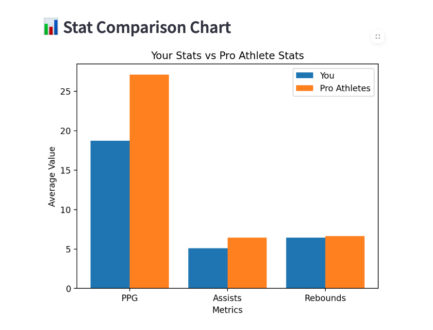

# 🏀 AI Performance Analyzer for Basketball Athletes

## 📋 Project Description
This app allows users to upload their basketball stats, compare them to professional athletes, and predict performance scores using a simple machine learning model.

Built with **Streamlit**, **Pandas**, **Matplotlib**, and **scikit-learn**.

---

## 🚀 Features
- Upload your own basketball performance data (CSV)
- Upload professional benchmark data (CSV)
- Compare Points Per Game (PPG), Assists, and Rebounds
- Get automatic feedback on your performance
- Visualize your stats against professionals
- Predict an AI-based "Performance Score" for each athlete using Linear Regression

---

## 🛠️ How to Run
1. Clone this repository to your computer:

    ```bash
    git clone YOUR_REPO_URL_HERE
    ```

2. Move into the project folder:

    ```bash
    cd your-project-folder
    ```

3. Install required packages:

    ```bash
    pip install -r requirements.txt
    ```

4. Launch the app:

    ```bash
    streamlit run app.py
    ```

5. Upload your CSV files and explore the results!

---

## 📂 Example CSV Structure
Your CSV files should include these columns:

| Athlete | Sport | PPG | Assists | Rebounds |
|:-------:|:-----:|:---:|:-------:|:--------:|

Example values:

| Athlete  | Sport       | PPG  | Assists | Rebounds |
|----------|-------------|------|---------|----------|
| You      | Basketball  | 18.5 | 5.1     | 6.3      |
| Friend 1 | Basketball  | 22.0 | 6.2     | 7.1      |

---

## 📸 Example Screenshots

### Main Upload Page


### Average Stats and Feedback


### Stat Comparison Chart


### Performance Score Table


### Performance Score Visualization


---

## 📚 Technologies Used
- Python
- Streamlit
- Pandas
- Matplotlib
- scikit-learn (Linear Regression)

---

## 👨‍💻 Developers
- Alexander Apolskis
- Rece Comeaux
